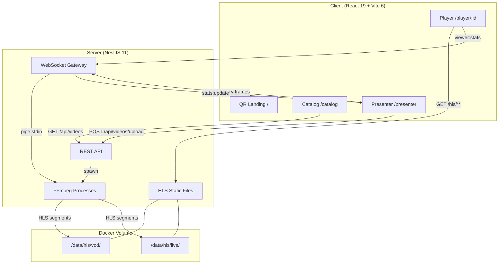
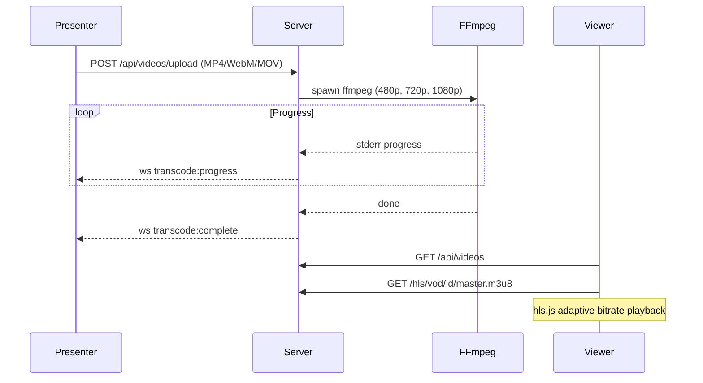
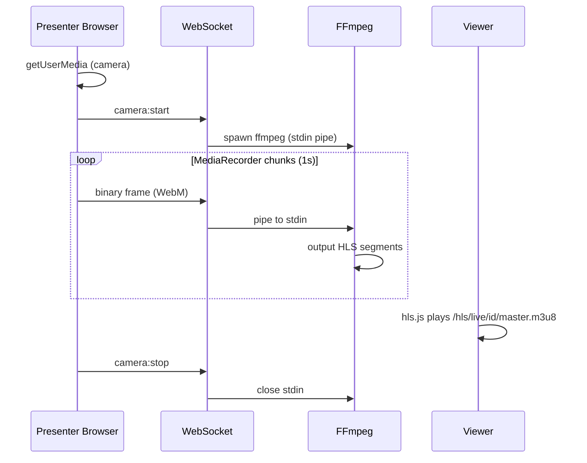
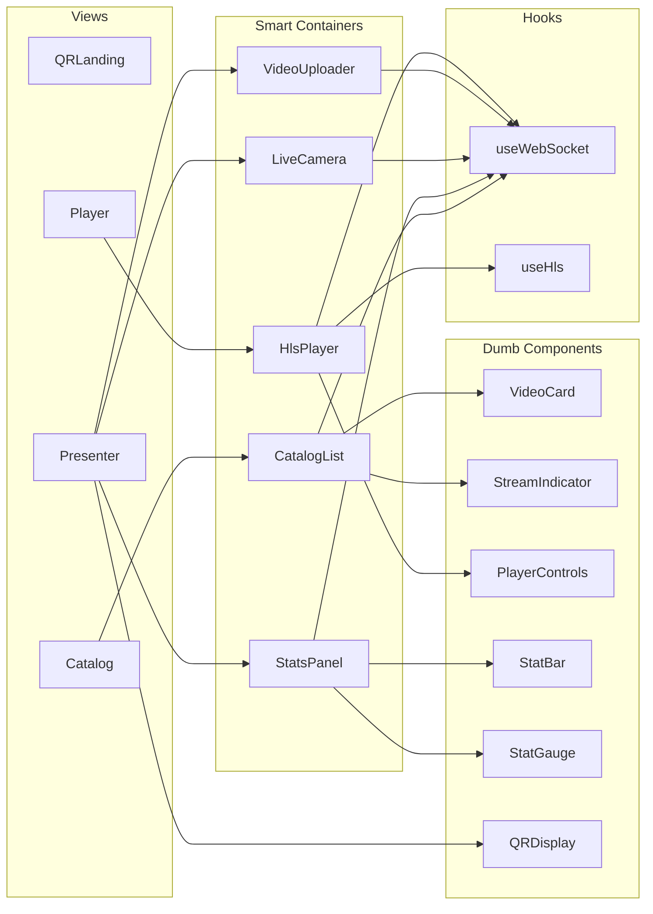
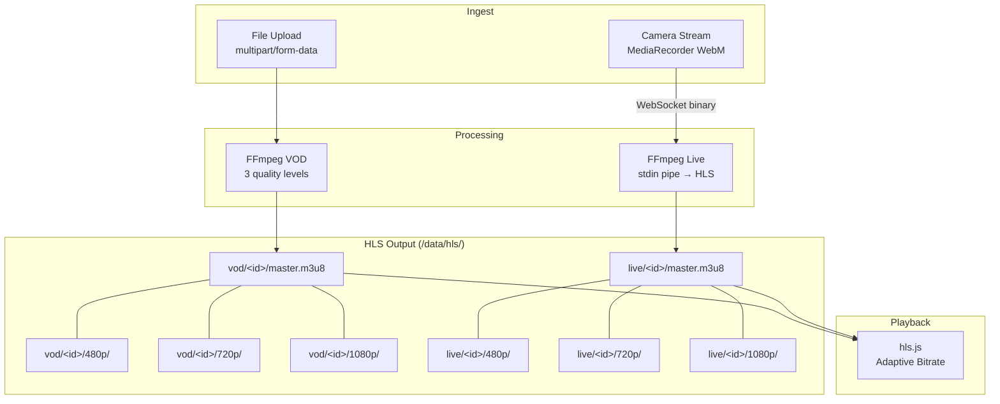

# Streaming 101

A complete video streaming demo stack for the [timjs](https://timjs.ro) meetup. Upload videos, stream live from your camera, and watch a real-time presenter dashboard — all running locally with Docker Compose.

## Architecture



## Quick Start

### Prerequisites

- Docker & Docker Compose
- Node.js 20+ (only for local/hybrid development)
- A webcam (for live streaming demo)

### Run

```bash
docker compose up
```

Open:
- **Presenter dashboard**: http://localhost:5173/presenter
- **Audience catalog**: http://localhost:5173/catalog

## Demo Flow

### 1. VOD Upload & Playback



1. Open `/presenter` and upload a video
2. Watch transcoding progress on the dashboard
3. Open `/catalog` — select the video and play it
4. Throttle network in DevTools to see quality switch

### 2. Live Camera Streaming



1. On `/presenter`, click **Start Live Stream** and allow camera
2. Open `/catalog` on another tab/device — the live stream appears
3. Adjust segment duration slider to see latency change

### 3. Audience Participation

1. Presenter shows the QR code from `/presenter`
2. Audience scans it and lands on `/catalog`
3. Presenter sees viewer count, bandwidth, and quality stats update in real time
4. Audience throttles network — dashboard shows quality degradation within 3 seconds

## Project Structure

```
streaming-101/
├── client/                          # React 19 + Vite 6 SPA
│   ├── src/
│   │   ├── components/              # Presentational (dumb) components
│   │   │   ├── VideoCard.jsx        # Video thumbnail + status badge
│   │   │   ├── PlayerControls.jsx   # Quality, bandwidth, buffer display
│   │   │   ├── StreamIndicator.jsx  # Live/VOD/Offline badge
│   │   │   ├── StatBar.jsx          # CSS-only horizontal bar chart
│   │   │   ├── StatGauge.jsx        # Large number display for projector
│   │   │   └── QRDisplay.jsx        # QR code wrapper (react-qr-code)
│   │   ├── containers/              # Smart components (data fetching)
│   │   │   ├── CatalogList.jsx      # Fetches videos + streams
│   │   │   ├── HlsPlayer.jsx       # hls.js + viewer stats reporting
│   │   │   ├── LiveCamera.jsx       # MediaRecorder + WebSocket binary
│   │   │   ├── VideoUploader.jsx    # Upload with progress tracking
│   │   │   └── StatsPanel.jsx       # Real-time dashboard stats
│   │   ├── views/                   # Route pages
│   │   │   ├── QRLanding.jsx        # / — audience entry point
│   │   │   ├── Catalog.jsx          # /catalog — video list
│   │   │   ├── Player.jsx           # /player/:id — VOD or live
│   │   │   └── Presenter.jsx        # /presenter — dashboard
│   │   ├── hooks/
│   │   │   ├── useWebSocket.js      # Auto-reconnect, JSON + binary
│   │   │   └── useHls.js            # hls.js lifecycle + stats
│   │   └── styles/
│   │       ├── variables.css        # Theme tokens (colors, sizes)
│   │       ├── reset.css            # Minimal CSS reset
│   │       └── layout.css           # Grid/flex utilities + responsive
│   ├── Dockerfile
│   └── vite.config.js               # Proxy /api, /hls, /ws to server
│
├── server/                          # NestJS 11 (TypeScript)
│   ├── src/
│   │   ├── videos/                  # VOD upload + FFmpeg transcoding
│   │   ├── streams/                 # Live stream management + FFmpeg
│   │   ├── ws/                      # WebSocket gateway + connection tracking
│   │   ├── stats/                   # GET /api/stats endpoint
│   │   ├── health/                  # Health check + process registry
│   │   ├── hls/                     # Static file serving for /hls/
│   │   ├── middleware/              # Request logging
│   │   ├── app.module.ts
│   │   └── main.ts                  # Bootstrap with WS adapter
│   ├── Dockerfile                   # Node 20 + FFmpeg
│   └── tsconfig.json
│
├── docker-compose.yml               # Full stack orchestration
├── docker-compose.debug.yml         # Debug overrides (inspect port)
├── scripts/
│   └── generate-fallback.sh         # Generate test video with HLS variants
└── notes/
    └── debugging.md                 # Detailed debugging guide
```

## Component Architecture



## Data Flow



## Debugging

### Run Modes

| Mode | Command | Use Case |
|------|---------|----------|
| Full Docker | `docker compose up` | Normal demo |
| Debug Docker | `docker compose -f docker-compose.yml -f docker-compose.debug.yml up` | Server breakpoints via Docker |
| Local server | `docker compose up client` + `cd server && npm run start:debug` | Server breakpoints without Docker |
| Local client | `docker compose up server` + `cd client && npm run dev` | Frontend debugging |
| Fully local | `npm run dev` in both `client/` and `server/` | Full local development |

### Attach a Debugger

**VS Code** — create `.vscode/launch.json`:

```json
{
  "version": "0.2.0",
  "configurations": [
    {
      "name": "Attach to Server",
      "type": "node",
      "request": "attach",
      "port": 9229,
      "address": "localhost",
      "restart": true,
      "sourceMaps": true,
      "localRoot": "${workspaceFolder}/server",
      "remoteRoot": "/app"
    },
    {
      "name": "Debug Client (Chrome)",
      "type": "chrome",
      "request": "launch",
      "url": "http://localhost:5173",
      "webRoot": "${workspaceFolder}/client/src"
    }
  ]
}
```

**WebStorm** — Run > Edit Configurations > Attach to Node.js > `localhost:9229`

**Chrome DevTools** — open `chrome://inspect`, ensure `localhost:9229` is listed, click **inspect**

### Monitor Processes

```bash
# Health check with sub-process visibility
curl http://localhost:3000/api/health | jq

# Example response
{
  "status": "ok",
  "uptime": 1234,
  "processes": [
    { "pid": 42, "type": "ffmpeg-transcode", "label": "abc123/720p", "status": "running" }
  ]
}
```

See [notes/debugging.md](notes/debugging.md) for the full debugging guide including troubleshooting tips.

## API Reference

### REST Endpoints

| Method | Path | Description |
|--------|------|-------------|
| `POST` | `/api/videos/upload` | Upload video (multipart, MP4/WebM/MOV) |
| `GET` | `/api/videos` | List all videos |
| `GET` | `/api/videos/:id` | Get video details |
| `GET` | `/api/streams` | List live streams |
| `PATCH` | `/api/streams/:id/config` | Update segment duration |
| `GET` | `/api/stats` | Aggregated viewer stats |
| `GET` | `/api/health` | Service health + process list |
| `GET` | `/hls/**` | HLS manifests and segments |

### WebSocket (`ws://host:3000/ws`)

| Message | Direction | Purpose |
|---------|-----------|---------|
| `viewer:connect` | Client > Server | Register as viewer |
| `viewer:stats` | Client > Server | Report quality/bandwidth (every 2s) |
| `presenter:connect` | Client > Server | Register as presenter |
| `camera:start` | Client > Server | Begin live ingest (switches to binary) |
| `camera:stop` | Client > Server | End live stream |
| `stats:update` | Server > Presenter | Aggregated viewer stats |
| `stream:started` | Server > All | Live stream began |
| `stream:ended` | Server > All | Live stream ended |
| `transcode:progress` | Server > Presenter | FFmpeg transcoding % |
| `transcode:complete` | Server > Presenter | Transcoding finished |

## Environment Variables

| Variable | Default | Description |
|----------|---------|-------------|
| `PORT` | `3000` | Server listen port |
| `MAX_UPLOAD_SIZE` | `524288000` | Max upload size in bytes (500 MB) |
| `HLS_SEGMENT_DURATION` | `4` | HLS segment length in seconds |
| `HLS_OUTPUT_DIR` | `/data/hls` | Volume path for HLS output |
| `INSPECT_HOST` | `0.0.0.0` | Node inspector bind address |
| `INSPECT_PORT` | `9229` | Node inspector port |

## Generate Fallback Content

Create a test video with all 3 quality levels so the demo works without uploading:

```bash
./scripts/generate-fallback.sh
```

## Tech Stack

| Layer | Technology | Why |
|-------|-----------|-----|
| Frontend | React 19, Vite 6, React Router v7 | Modern SPA, fast HMR, library mode routing |
| Playback | hls.js | Adaptive bitrate HLS in all browsers |
| QR Code | react-qr-code | SVG QR for audience mobile access |
| Backend | NestJS 11, TypeScript | Decorators for clean module structure |
| WebSocket | raw `ws` via @nestjs/platform-ws | Binary support, lighter than Socket.io |
| Transcoding | FFmpeg via child_process.spawn | Direct process control, no queue overhead |
| Storage | Docker volume, in-memory Maps | No database needed for a demo |
| Containers | Docker Compose | One command to run everything |

## License

MIT
