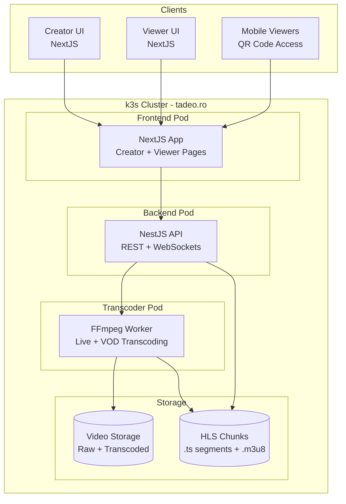
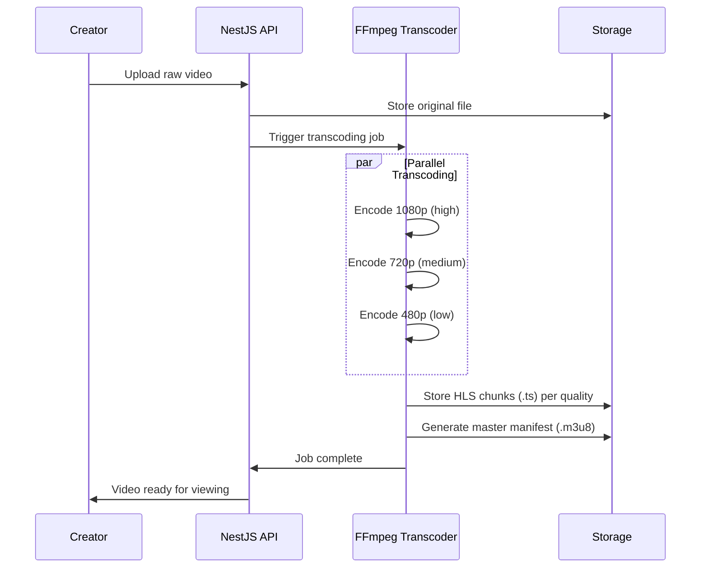
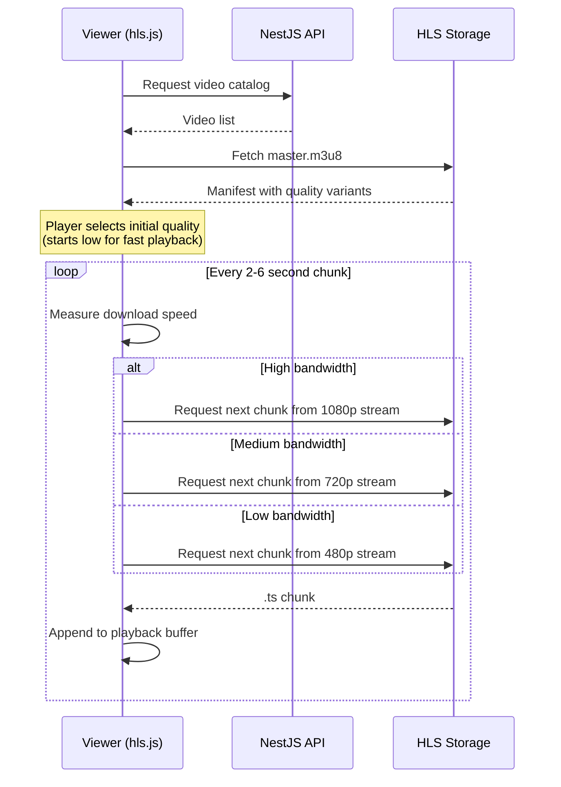
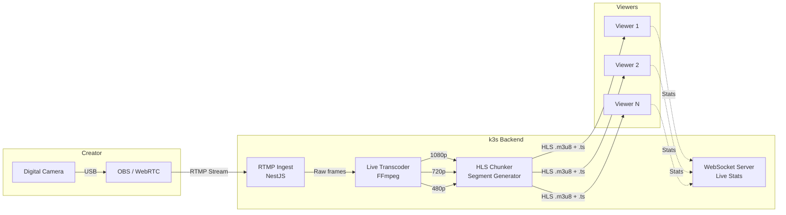
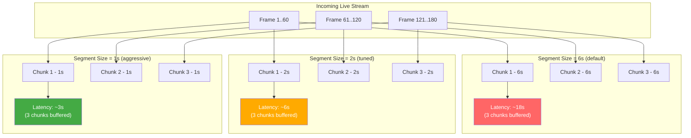
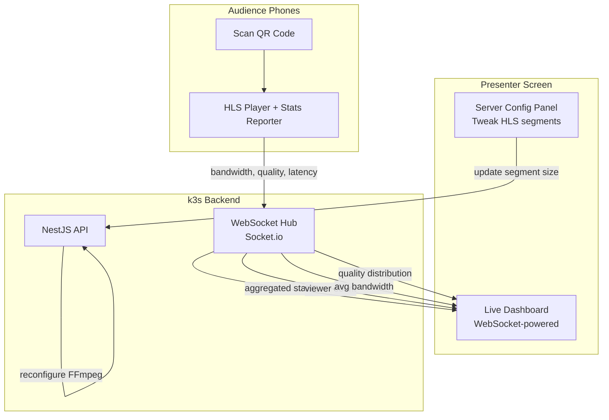
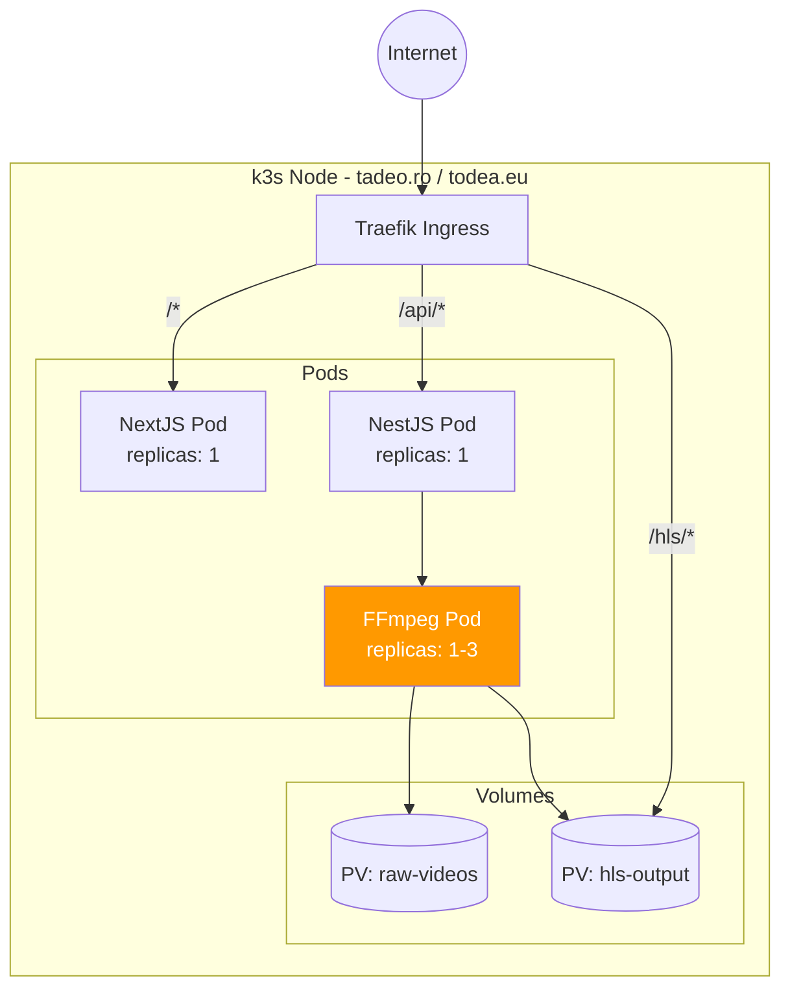

# Streaming 101 - Architecture Diagrams

## High-Level System Overview

## VOD Pipeline (Upload & Transcode)

## Adaptive Bitrate Streaming (ABR) - Viewer Flow

## Live Streaming Pipeline

## HLS Chunk Segmentation & Latency

## Wow Factor - Live Audience Interaction

## k3s Deployment Topology

