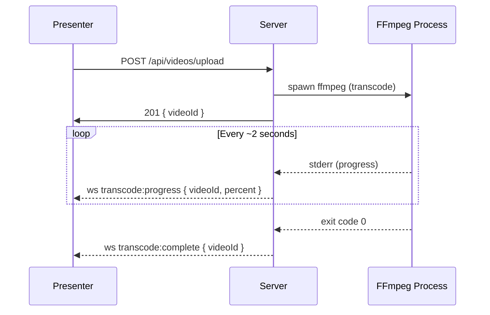

# Debugging Guide

## Quick Reference

| Mode | Command | What Runs |
|------|---------|-----------|
| Full Docker | `docker compose up` | Client + Server in containers |
| Debug Docker | `docker compose -f docker-compose.yml -f docker-compose.debug.yml up` | Both containers, server inspect on 9229 |
| Hybrid: local server | `docker compose up client` + run server locally | Client in Docker, server on host |
| Hybrid: local client | `docker compose up server` + `npm run dev` in client/ | Server in Docker, client on host |
| Fully local | `npm run dev` in both client/ and server/ | Everything on host |

## Server Debugging (Node.js Inspector)

### Start with Inspector

```bash
# Inside Docker (debug compose)
docker compose -f docker-compose.yml -f docker-compose.debug.yml up

# Locally
cd server
npm run start:debug
```

The server starts with `--inspect=0.0.0.0:9229` and listens for debugger connections.

### VS Code

Create `.vscode/launch.json`:

```json
{
  "version": "0.2.0",
  "configurations": [
    {
      "name": "Attach to Server",
      "type": "node",
      "request": "attach",
      "port": 9229,
      "address": "localhost",
      "restart": true,
      "sourceMaps": true,
      "localRoot": "${workspaceFolder}/server",
      "remoteRoot": "/app"
    },
    {
      "name": "Debug Client (Chrome)",
      "type": "chrome",
      "request": "launch",
      "url": "http://localhost:5173",
      "webRoot": "${workspaceFolder}/client/src",
      "sourceMapPathOverrides": {
        "webpack:///./src/*": "${webRoot}/*"
      }
    }
  ],
  "compounds": [
    {
      "name": "Full Stack Debug",
      "configurations": ["Attach to Server", "Debug Client (Chrome)"]
    }
  ]
}
```

1. Start the debug compose or run `npm run start:debug` locally
2. In VS Code, select **Attach to Server** and press F5
3. Set breakpoints in `server/src/` files — they hit immediately

### WebStorm / IntelliJ

1. Go to **Run → Edit Configurations → + → Attach to Node.js/Chrome**
2. Set:
   - Host: `localhost`
   - Port: `9229`
3. Click **Debug** (bug icon)
4. Breakpoints in `server/src/` will activate

### Chrome DevTools

1. Open `chrome://inspect` in Chrome
2. Click **Configure...** and ensure `localhost:9229` is listed
3. Your server process appears under **Remote Target**
4. Click **inspect** to open DevTools
5. Go to **Sources** tab, find your files under `file:///app/src/`
6. Set breakpoints directly in the DevTools UI

## Client Debugging (Browser)

### Vite + Source Maps

Vite serves source maps by default in dev mode. Open browser DevTools:

1. **Sources** → navigate to `localhost:5173` → `src/`
2. Set breakpoints in any `.jsx` file
3. React DevTools extension shows component tree and state

### VS Code (Chrome Debug)

Use the **Debug Client (Chrome)** launch config above. This opens a Chrome instance with VS Code breakpoints active in your JSX files.

## Hybrid Mode

### Local Server + Docker Client

When you want breakpoints in server code without Docker overhead:

```bash
# Terminal 1: Start only the client container
docker compose up client

# Terminal 2: Run server locally
cd server
npm run start:dev    # or start:debug for inspector
```

Update `client/vite.config.js` proxy target or set `SERVER_HOST`:

```bash
# The client container will reach your host machine via:
# On Linux: host.docker.internal or 172.17.0.1
# On macOS/Windows: host.docker.internal
```

### Local Client + Docker Server

```bash
# Terminal 1: Start only the server container
docker compose up server

# Terminal 2: Run client locally
cd client
npm run dev
```

The Vite proxy in `vite.config.js` already points to `localhost:3000`, which maps to the Docker server's exposed port.

## Monitoring Spawned Processes

### Health Check Endpoint

```bash
curl http://localhost:3000/api/health
```

Returns:

```json
{
  "status": "ok",
  "uptime": 1234,
  "processes": [
    {
      "pid": 42,
      "type": "ffmpeg-transcode",
      "videoId": "abc123",
      "status": "running"
    }
  ]
}
```

### Watching FFmpeg Transcoding

FFmpeg progress is reported via WebSocket `transcode:progress` messages. Connect to `ws://localhost:3000/ws` as a presenter to see real-time updates.



## Environment Variables

| Variable | Default | Purpose |
|----------|---------|---------|
| `PORT` | `3000` | Server listen port |
| `INSPECT_HOST` | `0.0.0.0` | Node inspector bind address |
| `INSPECT_PORT` | `9229` | Node inspector port |
| `HLS_OUTPUT_DIR` | `/data/hls` | Where HLS segments are stored |
| `MAX_UPLOAD_SIZE` | `524288000` | Max upload in bytes (500MB) |
| `HLS_SEGMENT_DURATION` | `4` | HLS segment length in seconds |

## Troubleshooting

### Inspector won't connect

- Ensure port 9229 is exposed: `docker compose port server 9229`
- Check the server started with `--inspect`: look for "Debugger listening on ws://..." in logs
- Try `docker compose logs server | grep inspect`

### Breakpoints not hitting (server)

- Verify source maps: `tsconfig.json` has `"sourceMap": true`
- Check `localRoot`/`remoteRoot` mapping in VS Code launch config
- ts-node-dev transpiles on the fly — breakpoints need the TS source, not compiled JS

### Hot reload not working in Docker

- Volume mounts are correct: `./server:/app` in compose
- `node_modules` is excluded via anonymous volume: `/app/node_modules`
- On Linux, check inotify limits: `echo 65536 | sudo tee /proc/sys/fs/inotify/max_user_watches`
