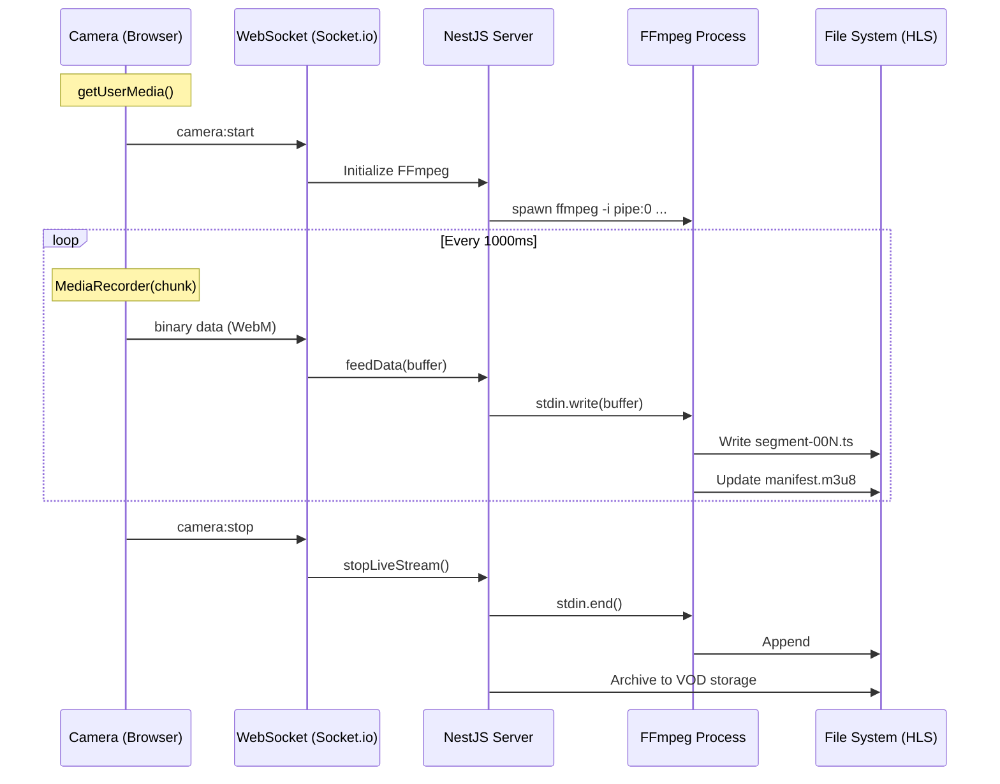

# How the Live Stream Works: Ingest & Processing

This note breaks down the internal mechanics of the live streaming pipeline, from the client's camera to the viewer's screen, focusing on the WebSocket-to-FFmpeg ingest bridge.

---

## 1. The Ingest Pipeline

The project uses a **MediaRecorder + WebSocket** ingest strategy. Instead of sending raw, uncompressed pixels (which would exceed gigabytes per second), the browser performs real-time hardware encoding.

### The Client Flow (The Producer)
Located in `client/src/containers/LiveCamera.jsx`:

1.  **Capture**: The browser accesses the camera via `navigator.mediaDevices.getUserMedia()`.
2.  **Compress**: The `MediaRecorder` API is initialized with a `video/webm` container. It uses the browser's internal codecs (usually **VP8** or **H.264**) to compress the frames on-the-fly.
3.  **Fragment**: The recorder is started with a `timeslice` of 1000ms (`recorder.start(1000)`), causing it to emit a "chunk" of compressed video every second.
4.  **Transport**: These binary chunks are sent to the server over a persistent **WebSocket** connection.

### The Server Flow (The Processor)
Located in `server/src/streams/streams.gateway.ts` and `streams.service.ts`:

1.  **Receive**: The NestJS WebSocket Gateway receives the binary buffer from the client.
2.  **Pipe**: The server has a spawned **FFmpeg** process running. The binary buffer is written directly into FFmpeg's `stdin` (`pipe:0`).
3.  **Transmux**: FFmpeg takes the incoming WebM/VP8 stream and converts it into multiple HLS quality tiers (1080p, 720p, 480p).
4.  **Segment**: FFmpeg writes small `.ts` files to disk and updates the `.m3u8` manifest.

---

## 2. Ingest Sequence Diagram



---

## 3. Why WebSocket? (WebSocket vs. WebRTC)

While **WebRTC** is the industry standard for sub-second latency (video calls), this project uses **WebSockets** for ingest. Here is a comparison of the trade-offs:

| Feature | WebSocket (Your Stack) | WebRTC |
| :--- | :--- | :--- |
| **Protocol** | **TCP** (Reliable / Ordered) | **UDP** (Unreliable / Real-time) |
| **Ingest Latency** | 1s – 2s (plus HLS buffering) | < 500ms |
| **Congestion** | **Head-of-Line Blocking**: One lost packet stops the whole stream until retransmitted. | **Adaptive**: Drops frames to stay in sync with the "Now." |
| **Complexity** | **Low**: Standard Node.js stream piping. No NAT traversal needed. | **High**: Requires STUN/TURN servers and complex ICE negotiation. |
| **Compatibility** | **High**: FFmpeg can read a TCP pipe as if it were a file. | **Low**: FFmpeg requires specialized plugins/libraries to act as a WebRTC peer. |

### The "Aha!" Moment
WebSockets are used here because they prioritize **Reliability** over **Real-time Speed**. By using TCP, we ensure that every single byte of the stream reaches the server. This makes it trivial to **Archive** the live stream into a high-quality VOD once it ends, because we have a perfect, bit-for-bit copy of what the recorder produced.

---

## 4. Relevant Code Highlights

### Client: Emitting Binary Data
```javascript
// client/src/containers/LiveCamera.jsx
recorder.ondataavailable = (e) => {
  if (e.data.size > 0) {
    ws.sendBinary(e.data); // Sends raw Blob over WebSocket
  }
};
```

### Server: The FFmpeg "Stdin" Bridge
```typescript
// server/src/streams/streams.service.ts
const args = [
  '-i', 'pipe:0', // Read input from standard input
  '-f', 'hls',    // Output as HLS segments
  // ... transcoding presets
];

const child = spawn('ffmpeg', args);

feedData(streamId: string, data: Buffer) {
  const proc = this.ffmpegProcesses.get(streamId);
  if (proc?.stdin?.writable) {
    proc.stdin.write(data); // Write binary buffer to FFmpeg's process memory
  }
}
```
