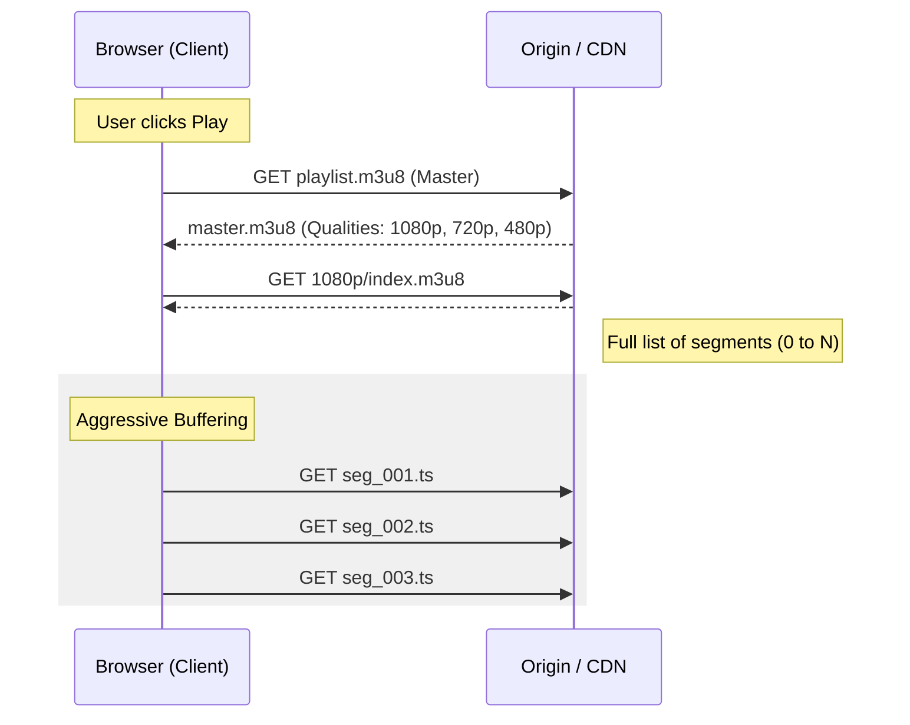
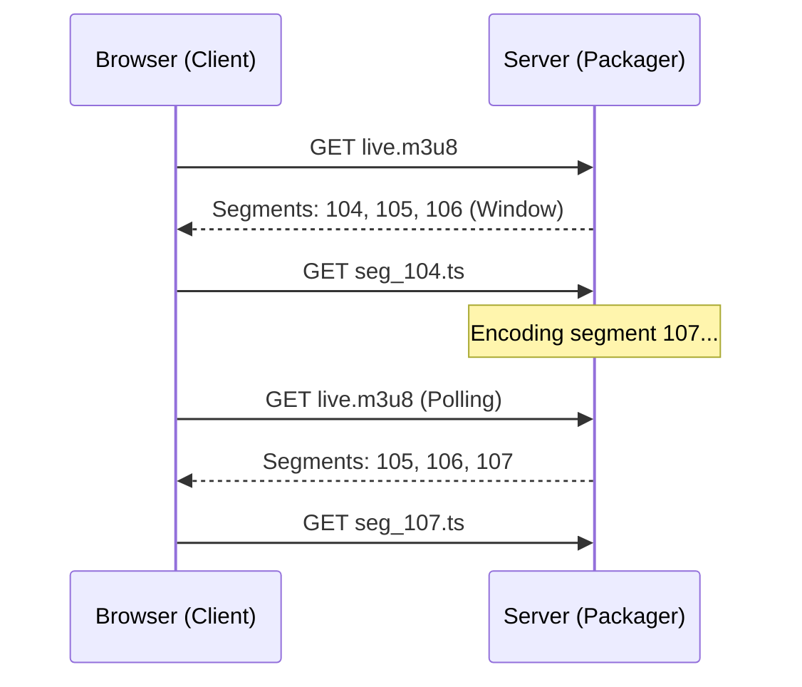
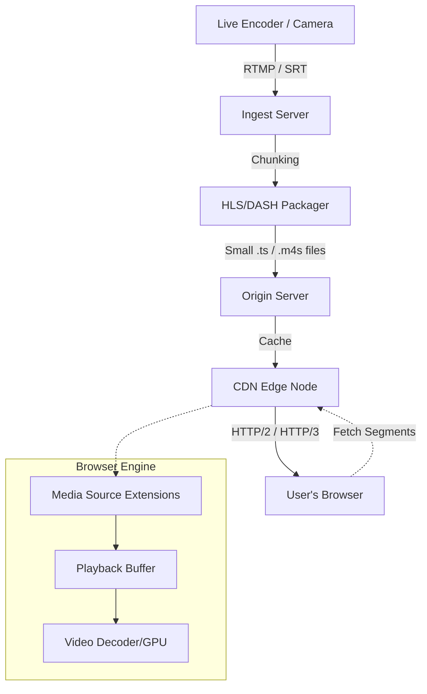

# Serving Videos: The Art of Packetized Continuity

How do we turn a discrete set of data packets into a seamless, "living" visual experience? This note explores the mechanics of video delivery, from the first principles of human perception to the complex dance of modern HTTP-based protocols.

---

## 1. The Core Illusion: Persistence of Vision

A video is just a series of still images (frames). Our brain creates the "illusion of continuity" through **Persistence of Vision** and the **Phi Phenomenon**.

### The Magic Number: 24
In the early days of cinema, 24 frames per second (fps) became the standard. 
*   **Trivia:** 24 fps wasn't chosen for "smoothness" alone—it was the minimum speed required for the optical sound-on-film tracks to be intelligible. Silent films often ran at 16–18 fps, which looked "choppy" but saved expensive film stock.

### The Continuity Equation
To maintain this illusion in a digital stream, the browser must ensure that the "consumption rate" never exceeds the "delivery rate."

Let $R_{in}(t)$ be the instantaneous download bitrate and $R_{out}(t)$ be the playback bitrate (the video's encoded bitrate). For continuous play:

$$
\int_{0}^{T} R_{in}(t) \, dt \ge \int_{0}^{T} R_{out}(t) \, dt
$$

If at any point $t$, the left side is less than the right side, the playback buffer empties: **Buffering occurs.**

---

## 2. VOD vs. Live: The Structural Difference

While both use segments, their "temporal geography" is fundamentally different.

### Video on Demand (VOD)
In VOD, the entire asset exists. The client has an "infinite lookahead." It can download the middle of the movie before the beginning if it wants.

### Live Streaming
In Live, the asset is being created in real-time. The manifest is a "sliding window." The client can only see what has already happened (and is currently happening).

---

## 3. How the Network Sends Packets

### The Protocol Evolution: From State to Stateless
1.  **RTMP (Real-Time Messaging Protocol):** Developed by Macromedia (then Adobe). It was **stateful** and ran over TCP. Great for low latency, but terrible for scaling because every client needed a persistent connection to the server.
2.  **HTTP-Based (HLS/DASH):** The industry moved to "segments over HTTP." This made video "just another file," allowing us to use standard Web Caches and CDNs (Cloudflare, Akamai) to scale to millions of users.

### Packet Flow Architecture

---

## 4. The Science of the Buffer: "The Leaky Bucket"

The browser uses a "Leaky Bucket" model to manage the video. 
*   **Incoming:** Network packets (variable speed).
*   **Outgoing:** Frames to the GPU (constant speed).

Let $B$ be the buffer size in bytes, and $S$ be the segment size. 
The **Time-to-Buffer** ($T_{buf}$) is:

$$
T_{buf} = \frac{S}{R_{in} - R_{out}}
$$

If $R_{in} \gg R_{out}$, the buffer fills instantly. If $R_{in}$ drops below $R_{out}$, the "bucket" begins to empty.

### ABR: Adaptive Bitrate Streaming
This is the engine of modern streaming. The browser monitors $R_{in}$ and says: *"Hey, the bucket is emptying too fast! Give me the 480p version instead of 1080p."*

---

## 5. The Temporal Tug-of-War: Why Rates Diverge

To understand "Rate," we need a **Time Reference**. Imagine two clocks:
1.  **The Producer Clock ($T_{prod}$):** Located at the camera/encoder. It ticks every time a frame is captured.
2.  **The Consumer Clock ($T_{cons}$):** Located in your browser. It ticks every time the GPU draws a frame.

In a perfect universe, $T_{prod}$ and $T_{cons}$ are perfectly synchronized. In the real world, the **Network** is a "Time Stretcher."

### The Concept of Rate Mismatch
Think of the video as a conveyor belt. 
*   **The Source (Rate A):** The encoder puts 30 boxes (frames) on the belt every second.
*   **The Sink (Rate B):** The player takes 30 boxes off the belt every second.

If the belt speed is constant, everything is fine. But the Internet isn't a conveyor belt; it's a series of **unreliable couriers**.

### Latency vs. Jitter: The Convergence Killers
1.  **Latency (Fixed Delay):** The time it takes for a single box to travel from the Source to the Sink. If latency is 500ms, the Sink just starts 500ms later. Continuity is preserved.
2.  **Jitter (Variable Delay):** This is the killer. Box 1 takes 100ms, Box 2 takes 900ms, Box 3 takes 50ms. 
    *   To the player, it looks like the **Source Rate** is fluctuating wildly, even if the encoder is perfectly steady.
    *   The player "sees" a mismatch: "I need a box every 33ms, but I haven't seen one for 800ms!"

### Visualizing the Timeline (The Birth to Death of a Packet)

The following Gantt chart shows how "wall clock time" (the absolute reference) relates to the different stages of a single second of video.

```mermaid
gantt
    title The Life of 1 Second of Video (30 Frames)
    dateFormat  X
    axisFormat %s
    
    section Production (Encoder)
    Capture Frame 1-30    :0, 1
    Encode & Segment      :1, 1.5
    
    section Network (The Stretch)
    Transit (Latency)     :1.5, 2.5
    Network Jitter (Delay):2.5, 3
    
    section Consumption (Browser)
    Buffer in RAM         :3, 4
    Decode & Playback     :4, 5
```

### The Divergence Formula
The mismatch between the **Arrival Time** ($A$) and the **Expected Playback Time** ($P$) for frame $i$ is:

$$
Divergence_i = A_i - (P_0 + i \times \Delta t)
$$

Where:
*   $P_0$ is the start time.
*   $\Delta t$ is the frame interval (e.g., 33.3ms for 30fps).
*   If $Divergence_i > 0$, the frame arrived **late**. If the buffer is empty, the video freezes.

> **Intuition for a Lifetime:** Continuity is not about the speed of the data, but the **consistency of the arrival**. A slow, steady stream is always better than a fast, stuttering one.

---

## 6. The Relativity of the Stream: Einstein’s Frame of Reference

In 1895, a 16-year-old Albert Einstein wondered: *"What would happen if I could chase a beam of light at the speed of light?"* He realized that if he could catch up to it, the light wave would appear frozen in space, like a stationary oscillation.

We can apply this **thought experiment** to the video buffer:

### The Packet's Perspective
If you were a single packet (a "bit-photon") sitting in the browser's RAM, the video would not exist. There is no time, only state. You are a static $1920 \times 1080$ grid of YUV values waiting to be read.

### The Playback Head's Perspective
The "flow" of the video only appears because the **Playback Head** (the observer) is moving through the segments at a constant velocity $v = 1 \text{ second/second}$. 

$$
\Delta \tau = \frac{\Delta t}{\sqrt{1 - v^2/c^2}} \quad \text{(The Streaming Version)}
$$

*   **Buffering is Time Dilatation:** When the network slows down, the "distance" between packets increases. To the observer (the viewer), time seems to stretch or stop (the spinner). 
*   **The Global Clock:** In Live streaming, there is a "Universal Now" (the wall-clock time at the encoder). Every packet has a timestamp (PTS - Presentation Time Stamp). The browser’s job is to synchronize its local clock to this global "light-cone" of data.

> **Hat Tip:** Just as Einstein realized that time is relative to the observer's motion, a video stream is only "fluid" relative to the playback head's consistent consumption of the buffer.

---

## 6. Engineering Nuggets & Trivia

### The Group of Pictures (GOP)
Video compression doesn't save every frame as a full image. It uses:
*   **I-Frames (Intra):** A full image (like a JPEG).
*   **P-Frames (Predicted):** Only the changes from the previous frame.
*   **B-Frames (Bi-predictive):** Changes from both *previous* and *future* frames.
*   **Nugget:** You can only "cut" or "start" a video at an I-Frame. This is why when you seek in a video, there's sometimes a tiny delay—the player is finding the nearest I-Frame.

### The "7-Second Delay"
Why is "Live" TV actually 7-30 seconds behind?
1.  **Encoding:** 1-2s.
2.  **Segmentation:** HLS usually needs 3 segments in the manifest before playing. If segments are 2s each, that's 6s of "safety" buffer.
3.  **CDN Propagation:** 1-2s.
4.  **Trivia:** Low-Latency HLS (LL-HLS) and DASH reduce this by using "partial segments" (chunks of chunks).

### MSE: The Bridge
Before **Media Source Extensions (MSE)**, browsers could only play a static `.mp4` file. MSE allowed JavaScript to "pump" raw bytes into the video tag, making HLS and DASH possible without third-party plugins like Flash.

---

## 6. Summary: The Pipeline of Light

1.  **Light** hits a sensor (Camera).
2.  **Math** compresses the pixels (HEVC/H.264).
3.  **Logic** chops it into segments (Packager).
4.  **Networking** routes it through the globe (CDN).
5.  **JavaScript** manages the bucket (MSE/ABR).
6.  **Light** hits your eyes (Display).

The continuity is never real—it's just a very well-managed queue.
