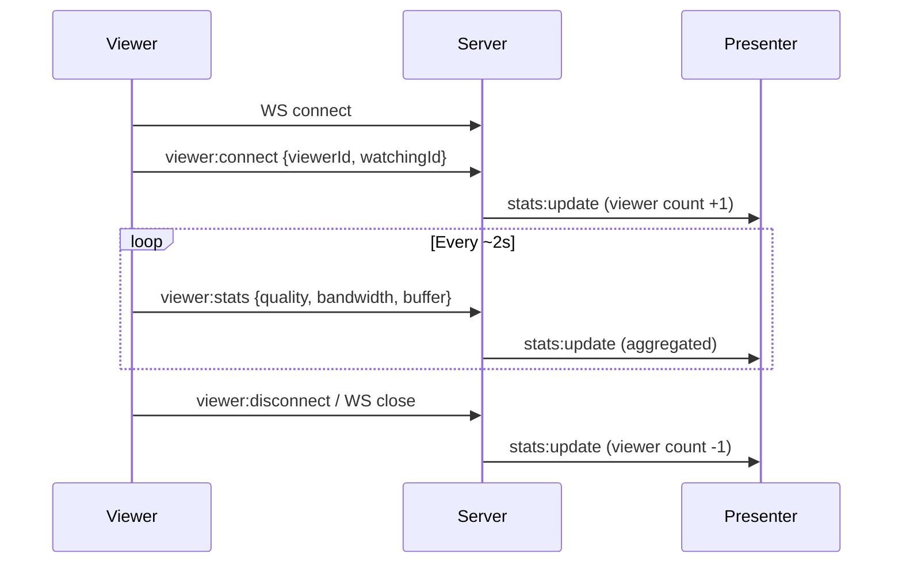
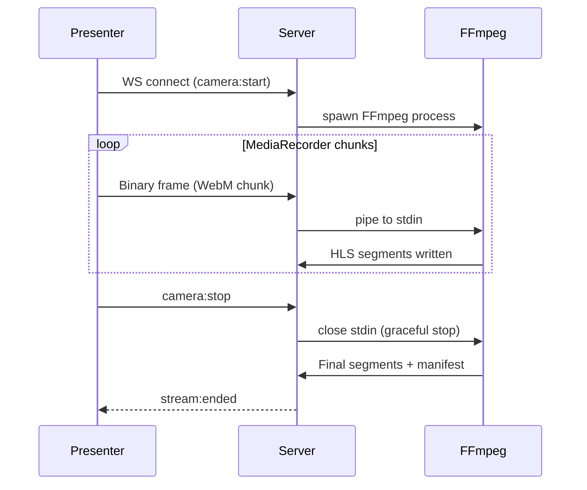

# WebSocket API Contract

**URL**: `ws://{host}:3000/ws`

All messages are JSON (text frames) except camera ingest which uses binary frames.

## Connection Types

The server distinguishes connections by an initial handshake message sent immediately after connection.

### Viewer Connection

```json
{ "type": "viewer:connect", "viewerId": "uuid", "watchingId": "video-or-stream-id" }
```

### Presenter Connection

```json
{ "type": "presenter:connect" }
```

### Camera Ingest Connection

```json
{ "type": "camera:start" }
```

After this handshake, the connection switches to **binary mode** — all subsequent frames are raw WebM chunks from MediaRecorder.

## Client → Server Messages

### viewer:stats (sent by viewer every ~2 seconds)

```json
{
  "type": "viewer:stats",
  "viewerId": "uuid",
  "currentQuality": "720p",
  "bandwidth": 4500,
  "bufferLevel": 8.2
}
```

### viewer:disconnect (sent on page unload)

```json
{ "type": "viewer:disconnect", "viewerId": "uuid" }
```

### camera:stop (presenter stops live stream)

```json
{ "type": "camera:stop" }
```

## Server → Client Messages

### stats:update (broadcast to presenter connection)

Sent whenever viewer stats change (throttled to max 2/second).

```json
{
  "type": "stats:update",
  "viewerCount": 23,
  "viewers": [
    {
      "id": "uuid",
      "connectedTo": "video-uuid",
      "currentQuality": "720p",
      "bandwidth": 4500,
      "bufferLevel": 8.2
    }
  ],
  "avgBandwidth": 3800,
  "qualityDistribution": { "480p": 5, "720p": 12, "1080p": 6 }
}
```

### stream:started (broadcast to all)

```json
{ "type": "stream:started", "streamId": "uuid" }
```

### stream:ended (broadcast to all)

```json
{ "type": "stream:ended", "streamId": "uuid" }
```

### transcode:progress (sent to presenter)

```json
{
  "type": "transcode:progress",
  "videoId": "uuid",
  "progress": 67,
  "currentQuality": "720p"
}
```

### transcode:complete (sent to presenter)

```json
{ "type": "transcode:complete", "videoId": "uuid" }
```

### transcode:error (sent to presenter)

```json
{ "type": "transcode:error", "videoId": "uuid", "error": "FFmpeg exited with code 1" }
```

## Connection Lifecycle




