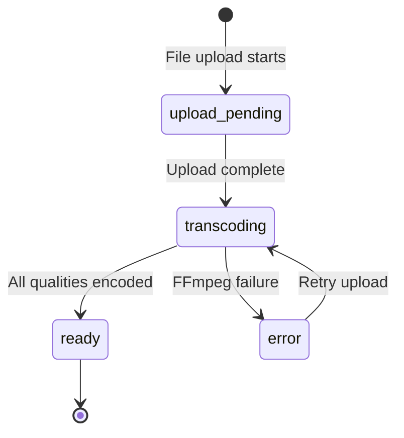
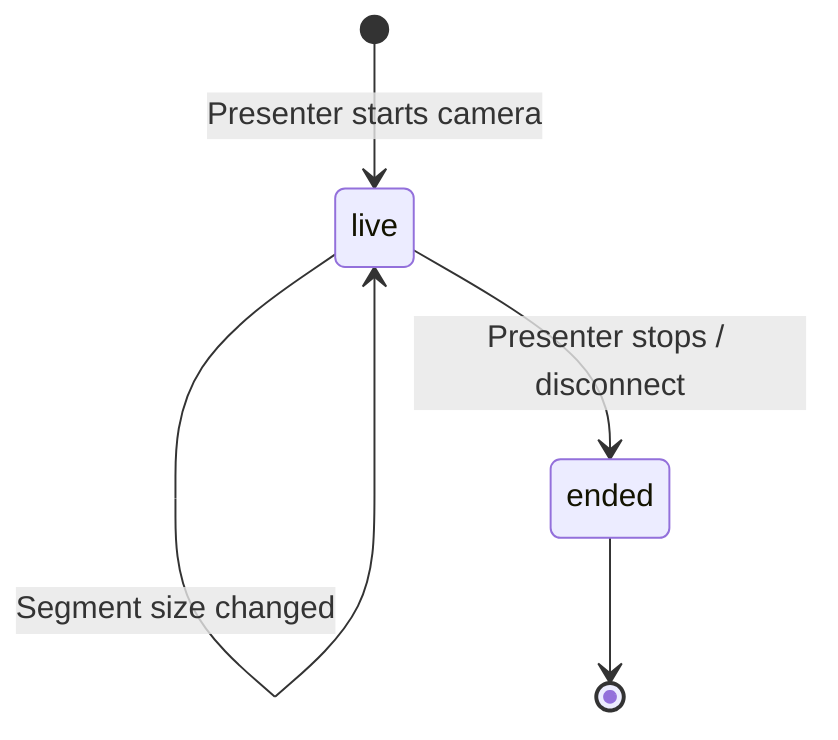
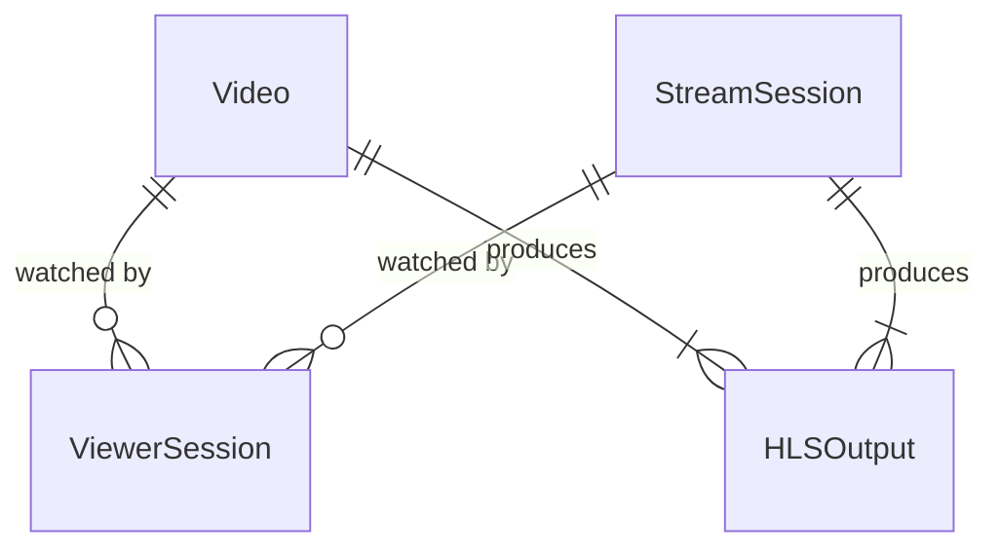

# Data Model: Streaming Demo Stack

**Date**: 2026-04-07
**Branch**: `001-streaming-demo-stack`

## Entities

### Video

Represents an uploaded VOD source and its transcoding state.

| Field | Type | Description |
|-------|------|-------------|
| id | string (uuid) | Unique identifier |
| title | string | Display name (derived from filename) |
| originalPath | string | Path to uploaded file on volume |
| format | string | Source format: mp4, webm, mov |
| fileSize | number | Bytes |
| status | enum | upload_pending, transcoding, ready, error |
| qualities | array | Available quality levels after transcoding |
| hlsManifestPath | string | Path to master .m3u8 |
| createdAt | timestamp | Upload time |
| transcodingProgress | number | 0-100 percentage |
| errorMessage | string | null unless status=error |

**State transitions**:



### StreamSession

Represents an active live streaming session from the presenter's camera.

| Field | Type | Description |
|-------|------|-------------|
| id | string (uuid) | Unique identifier |
| status | enum | live, ended |
| segmentDuration | number | Current HLS segment size in seconds |
| hlsManifestPath | string | Path to live master .m3u8 |
| startedAt | timestamp | Stream start time |
| endedAt | timestamp | null while live |
| qualities | array | Transcoded quality levels |

**State transitions**:



### ViewerSession

Represents a connected viewer watching any stream.

| Field | Type | Description |
|-------|------|-------------|
| id | string (uuid) | Session ID (generated client-side) |
| connectedTo | string | Video ID or StreamSession ID |
| connectedToType | enum | vod, live |
| currentQuality | string | e.g., "720p" |
| bandwidth | number | Measured download speed (kbps) |
| bufferLevel | number | Seconds of buffered content |
| connectedAt | timestamp | When viewer joined |
| lastReportAt | timestamp | Last stats report time |

**Note**: Viewer sessions are ephemeral (in-memory only). They exist while the WebSocket connection is open and are removed on disconnect.

### HLS Output Structure

Not a stored entity — a file convention on the Docker volume.

```
/data/hls/
  vod/
    {video-id}/
      master.m3u8          # master manifest
      480p/
        stream.m3u8        # variant manifest
        segment-001.ts     # 2-6s chunks
        segment-002.ts
      720p/
        stream.m3u8
        segment-*.ts
      1080p/
        stream.m3u8
        segment-*.ts
  live/
    {session-id}/
      master.m3u8
      480p/
        stream.m3u8
        segment-*.ts       # rolling window
      720p/ ...
      1080p/ ...
```

## Relationships



## In-Memory State (no database)

All entities live in memory (Maps/objects) on the NestJS server. There is no database. Video metadata and stream sessions are reconstructed from the filesystem on startup by scanning `/data/hls/vod/` and `/data/hls/live/`. Viewer sessions exist only while WebSocket connections are open.

This is a demo system — persistence across server restarts is provided by the Docker volume for video files only, not for metadata.
