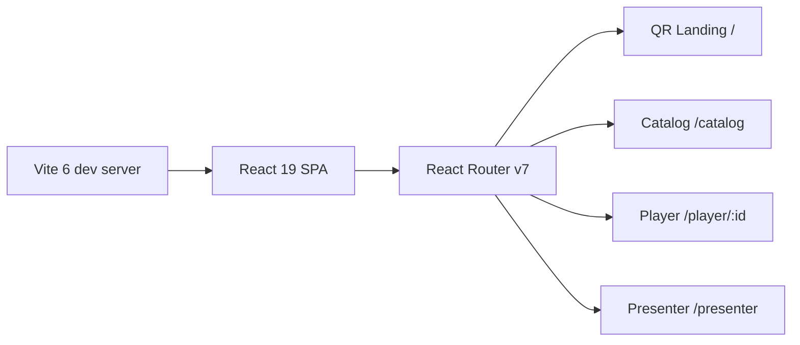
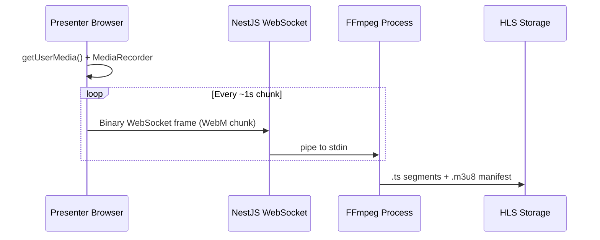

# Research: Streaming Demo Stack

**Date**: 2026-04-07
**Branch**: `001-streaming-demo-stack`

## Decision 1: React + Vite vs Next.js

**Decision**: React 19 + Vite 6 + React Router v7 (library mode)

**Rationale**: Next.js solves problems we don't have (SSR, SEO, API routes). We have a separate NestJS backend, only 4 client-side views, and no server rendering need. Next.js would add ~20 transitive dependencies, a Node server runtime, and App Router complexity (server/client component boundaries) that fights the lean code constitution.

**Alternatives considered**:
- **Next.js 15**: File-based routing, SSR, server components. Rejected: unnecessary complexity, blurs frontend/backend boundary, heavier dependency tree.
- **Plain HTML + vanilla JS**: Considered but rejected — React's component model is needed for the smart/dumb split (Constitution IX) and the dashboard's real-time updates.

**Versions**: React 19, Vite 6, React Router v7



## Decision 2: Camera Ingest — MediaRecorder + WebSocket vs WebRTC SFU

**Decision**: MediaRecorder API + WebSocket binary transport

**Rationale**: The browser uses `getUserMedia()` (WebRTC API) to capture the camera, then `MediaRecorder` encodes to WebM chunks, and sends them over a plain WebSocket as binary frames. The server pipes these directly into FFmpeg stdin. This avoids all SFU complexity (STUN/TURN, SDP, ICE negotiation) and is ~20 lines on the browser, ~15 on the server.

**Alternatives considered**:
- **mediasoup (SFU)**: Very high complexity, C++ native build dependency. Overkill for a demo with one stream.
- **node-webrtc (`wrtc`)**: Package abandoned (last release 2020). Fork `@roamhq/wrtc` exists but heavy native deps.
- **RTMP via OBS**: Rejected in spec clarification — browser-only is required.

**Educational value**: Each pipeline step is visible and fits on a slide:
1. `getUserMedia()` — camera access
2. `MediaRecorder` — encode to chunks
3. `WebSocket` — binary transport
4. `FFmpeg` — transcode to HLS
5. `hls.js` — adaptive playback



## Decision 3: Transcoding Jobs — child_process vs BullMQ

**Decision**: Direct `child_process.spawn('ffmpeg', args)`

**Rationale**: For a demo with one concurrent stream, a job queue adds Redis as a dependency and queue management overhead for zero benefit. Spawning FFmpeg directly is 5 lines of code, fully transparent, and easy to explain on stage.

**Alternatives considered**:
- **@nestjs/bullmq + Redis**: Proper queue with progress tracking. Rejected: requires Redis container, queue boilerplate, overkill for single-stream demo.
- **fluent-ffmpeg**: npm wrapper around FFmpeg. Rejected: adds abstraction over something that's already a 1-line spawn command, obscures the actual FFmpeg flags we want to show.

## Decision 4: WebSocket Library — ws vs Socket.io

**Decision**: Raw `ws` via `@nestjs/platform-ws`

**Rationale**: Socket.io adds ~60KB client overhead and a custom protocol. For binary camera streaming, we need raw WebSocket frames. For stats broadcasting, the server tracks connected clients and broadcasts — ~10 lines of code, no rooms needed. The browser's native `WebSocket` API is sufficient on the client side, eliminating the `socket.io-client` dependency entirely.

**Alternatives considered**:
- **Socket.io (@nestjs/platform-socket.io)**: Built-in rooms and auto-reconnect. Rejected: custom protocol overhead, not needed for binary streaming, adds a client-side dependency. We can implement reconnect with 3 lines of `WebSocket.onclose` handler.

## Decision 5: Frontend Libraries — Minimal Set

**Decision**: hls.js + react-qr-code + CSS-only charts

| Package | Version | Gzipped Size | Purpose |
|---------|---------|-------------|---------|
| hls.js | 1.6.15 | ~60 KB | HLS playback + ABR |
| react-qr-code | 2.0.18 | ~14 KB | QR code SVG |
| *(native WebSocket)* | -- | 0 | Real-time stats |
| *(CSS custom properties)* | -- | 0 | Dashboard gauges/bars |

**Total added JS weight**: ~74 KB gzipped (2 packages)

**Charting**: CSS-only bars using `width: var(--pct)` with transitions. A `<div>` per metric. No chart library needed for live current-value display. If time-series history is needed later, uPlot (1.6.32, 45 KB) is the fallback.

**Alternatives rejected**:
- `qrcode.react` (115 KB) — 8x larger than react-qr-code for same output
- `socket.io-client` (17 KB gzipped) — unnecessary, native WebSocket suffices
- `chart.js` (200+ KB) — way too heavy for simple live bars

## Decision 6: TypeScript for NestJS, Plain JS for React

**Decision**: TypeScript for backend (NestJS), plain JavaScript for frontend (React)

**Rationale**: NestJS requires decorators (`@Controller`, `@WebSocketGateway`, etc.) which demand TypeScript (or Babel with decorator plugin). The constitution says "No TypeScript unless a dependency demands it" — NestJS demands it. The React frontend has no such constraint and stays plain JS per constitution.

## Complete Dependency Map

### Backend (NestJS) — 7 packages + system FFmpeg

```
@nestjs/core
@nestjs/common
@nestjs/platform-express
@nestjs/websockets
@nestjs/platform-ws
@nestjs/serve-static
reflect-metadata
```

### Frontend (React) — 3 core + 2 runtime deps

```
react               # core
react-dom            # core
react-router         # routing (4 views)
hls.js               # HLS playback
react-qr-code        # QR code display
```

Build tooling: `vite`, `@vitejs/plugin-react`

### System dependencies

- FFmpeg (installed in Docker image, not npm)

**Total npm packages: 12** (7 backend + 5 frontend)
