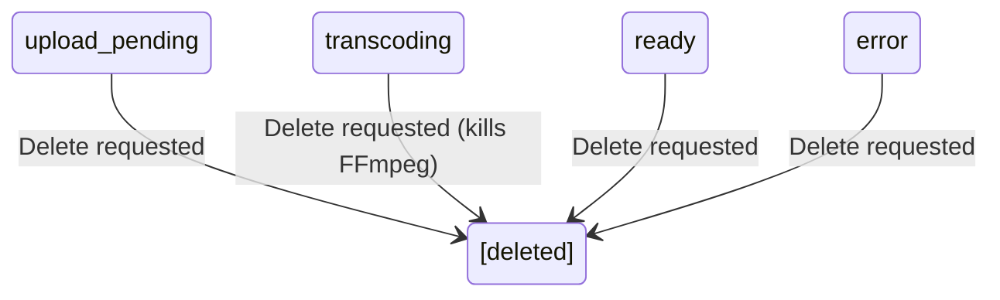

# Data Model: Delete Uploaded Videos

**Date**: 2026-04-07
**Branch**: `002-delete-uploaded-videos`

## Entity Changes

### Video (existing entity — modified behavior)

No new fields. The delete operation removes the entity entirely from the in-memory Map.

**New state transition**:



**Delete side effects by status**:

| Current Status | Action on Delete |
|---------------|-----------------|
| upload_pending | Remove entity, delete partial upload file |
| transcoding | Kill FFmpeg process, remove entity, delete partial HLS output |
| ready | Remove entity, delete all HLS files (master + variants + segments) |
| error | Remove entity, delete any partial files |

### File Cleanup

On delete, the entire directory tree is removed:

```
/data/hls/vod/{video-id}/    ← rm -rf this directory
├── master.m3u8
├── 480p/
│   ├── stream.m3u8
│   └── segment-*.ts
├── 720p/
│   └── ...
└── 1080p/
    └── ...
```

Also remove the original upload file from `/data/hls/uploads/` if it still exists.

## New WebSocket Event

### video:deleted (Server → All)

Broadcast to all connected clients when a video is deleted.

```json
{ "type": "video:deleted", "videoId": "uuid" }
```

Clients receiving this event remove the video from their local catalog state.
