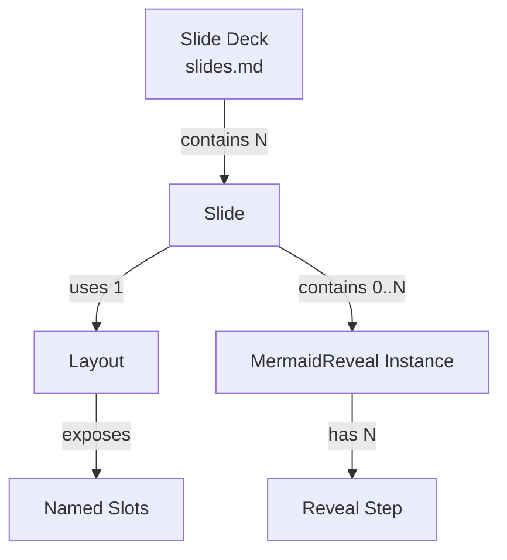

# Data Model: Slidev Presentation Slides

This feature has no runtime data model — slides are static content authored in Markdown and built to HTML/JS/CSS. The "entities" below describe the structural elements of the slide deck as authored by the presenter.

## Entities

### Slide

A single screen of the presentation.

| Attribute    | Type     | Description                                      |
|-------------|----------|--------------------------------------------------|
| layout      | string   | Layout name (e.g., `cover-image`, `default`)     |
| title       | string   | Optional frontmatter title for navigation        |
| clicks      | integer  | Number of v-click steps within the slide         |
| content     | markdown | Body content (text, code, diagrams, slots)       |

### Layout

A reusable Vue component defining slide structure.

| Attribute    | Type     | Description                                      |
|-------------|----------|--------------------------------------------------|
| name        | string   | File name without extension (e.g., `pros-cons`)  |
| slots       | string[] | Named slots the layout exposes (e.g., `right`, `pros`, `cons`) |
| props       | object   | Frontmatter props the layout accepts             |

### MermaidReveal Instance

A progressive-reveal diagram embedded in a slide via the `<MermaidReveal>` component.

| Attribute    | Type     | Description                                      |
|-------------|----------|--------------------------------------------------|
| diagram     | string   | Mermaid diagram source code                      |
| steps       | integer  | Number of reveal steps (auto-detected from diagram elements) |
| type        | enum     | `sequence`, `flowchart`, `graph`                 |

## Relationships

## Layout Catalog

| Layout | Slots | Props | Use Case |
|--------|-------|-------|----------|
| cover-image | default, right | image | Opening slide with image left, text right |
| pros-cons | pros, cons | — | Two-column comparison with v-click items |
| quote | default | author, source | Centered quotation with attribution |
| full-image | — | image, alt | Full-bleed screenshot, zero chrome |
| url-reference | default | — | Documentation link list |
| next-adventure | default | — | "Choose your next adventure" topic cards |
| demo-break | — | title, url | "Switch to live app" transition |
